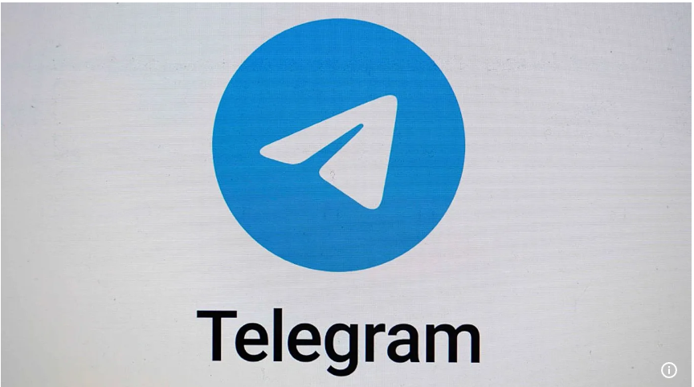
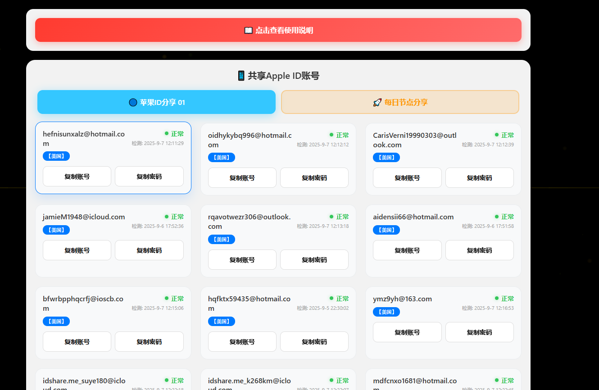
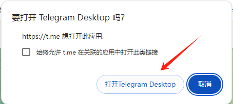
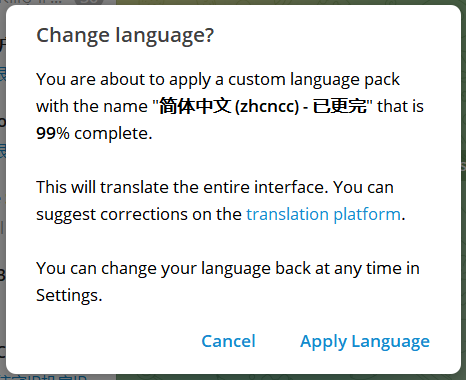
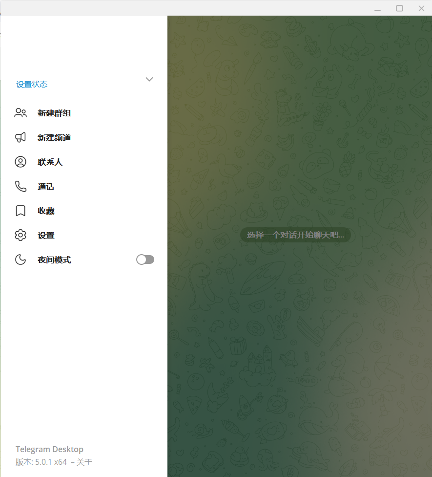
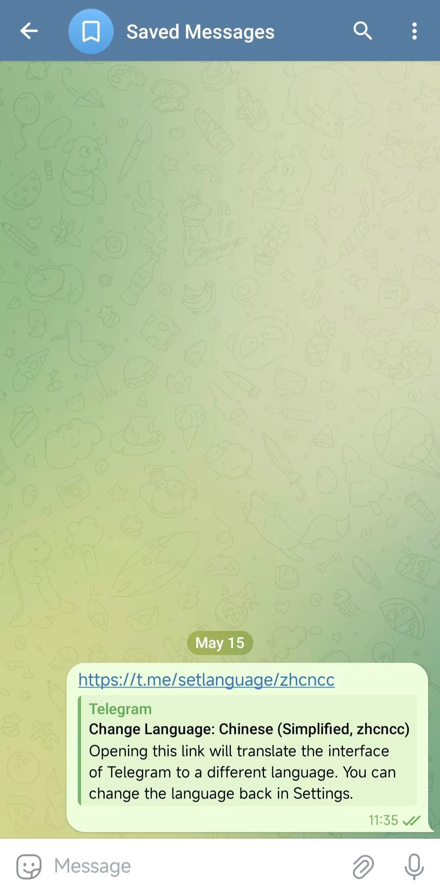
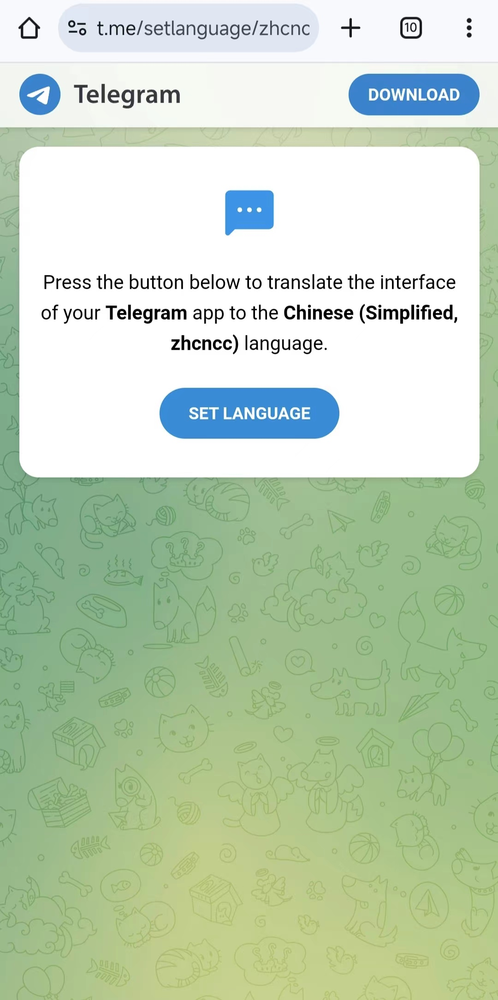
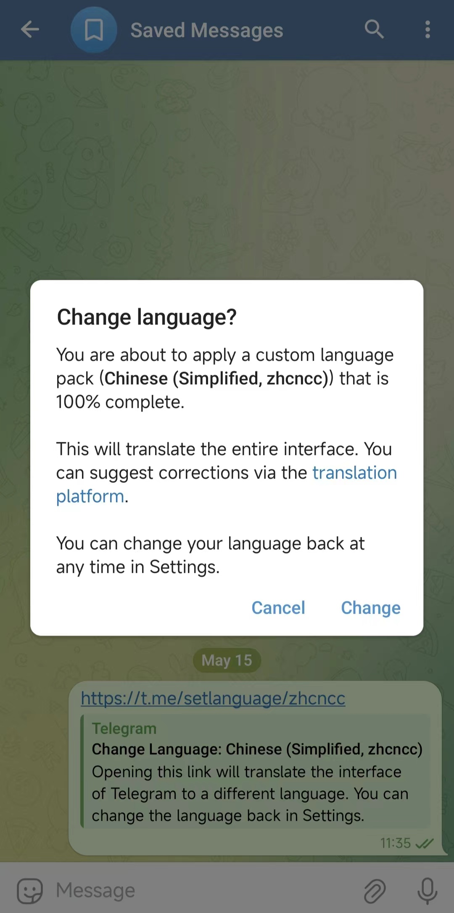
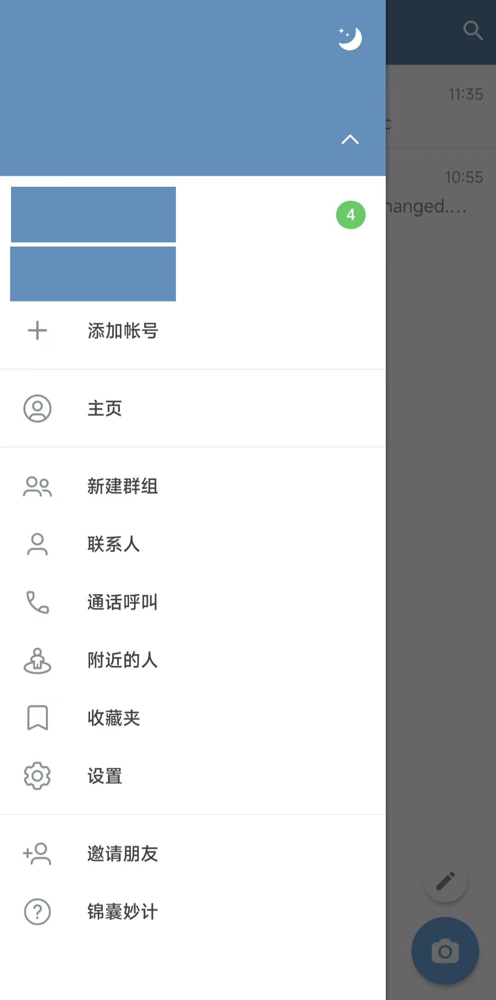

本文章源自：

[apple ID共享站](https://www.52021299.xyz/)

[telegram中文版中文包](https://t.me/xxoo369/24)

[telegram 搜索群](https://t.me/sotianxia)

[telegram 防封防骗 导航频道](https://t.me/xxoo369)

[宝可梦高速度机场 加入tg群享受每月免费60G流量](https://web4.52pokemon.cc/register?code=qzhkvhLk)

Telegram 中文设置 & 多账号管理

Telegram（电报，简称 TG）是一款支持端到端加密的即时聊天软件，安全性很高。不过有一点小遗憾，它的界面默认是没有中文的。

如果你想用中文，其实可以通过语言包来实现。目前 Telegram 官方只开放了语言翻译的接口，但没有自带中文包，所以网上能找到的中文语言包基本都是爱好者翻译的，
更新速度不一定快，有些甚至已经停更了。不过，用来日常聊天还是没问题的。你可以选择简体或繁体中文，根据需求安装即可。

另外，很多人不止有一个 Telegram 账号，要同时管理多个账号确实有点麻烦。这时候就可以用 AdsPower 指纹浏览器 来帮忙。它的原理是把每个账号放在隔离的环境里
运行，并且可以给不同账号分配不同的代理 IP，这样既能避免账号之间互相影响，又能轻松实现跨国沟通。用 AdsPower 管理多账号，不仅更安全，也能大大提高效率。

Telegram中文设置步骤

电脑版Telegram中文设置方法
1、打开并登录Telegram软件

2、点击以下链接 直接安装

[telegram中文版中文包](https://t.me/xxoo369/24)  

或者也可以进入搜索群，里面搜汉化包

[telegram 搜索群](https://t.me/sotianxia)

本站建议用此办法。毕竟新注册的帐号，前期频繁加群容易被封
有一个搜索群。想看什么。想找什么，就可以随心所欲的查找了。

建议只加一个搜索群。和本站推荐的导航群。其它的群慢慢加。平均一天加两三个就行

3、如下图所示，点击弹出的“打开Telegram Desktop”，电脑会自动打开Telegram 软件

4、在电报 软件内会出现提示窗，这儿显示了telegram中文汉化包的翻译进度（X%），点击“Apply Language”，应用该语言包

此时，你Telegram（电报）中文版下载。就成功了。下图展示为纸分机简体中文版

========================================================================================================
移动手机端电报中文版设置方法

1、在手机上登录Telegram APP

2、将以下链接复制到电报里的Saved Messages，并点击该链接；或者将链接复制到手机浏览器并访问，点击“SET LANGUAGE”

2、点击以下链接 直接安装

[telegram中文版中文包](https://t.me/xxoo369/24)  

或者也可以进入搜索群，里面搜汉化包

[telegram 搜索群](https://t.me/sotianxia)

本站建议用此办法。毕竟新注册的帐号，前期频繁加群容易被封
有一个搜索群。想看什么。想找什么，就可以随心所欲的查找了。

建议只加一个搜索群。和本站推荐的导航群。其它的群慢慢加。平均一天加两三个就行

3、如下图所示，点击之后，会在telegram APP内显示弹窗，选择“Change”

最后，你的Telegram 中文版APP 就搞定啦

