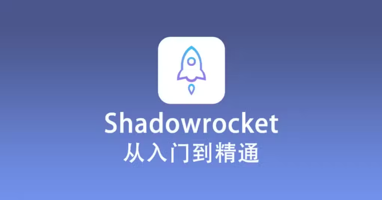

新账号初期操作规范

[apple ID共享站](https://www.52021299.xyz/)

[telegram 搜索群](https://t.me/sotianxia)

[telegram 防封防骗 导航频道](https://t.me/xxoo369)

[宝可梦高速度机场 加入tg群享受每月免费60G](https://web4.52pokemon.cc/register?code=qzhkvhLk)

[telegram中文版中文包](https://t.me/xxoo369/24)
刚到手的 Telegram 账号切勿立即大量互动，第一天不建议加群或私聊；若账号是接码新建的，首日应完全避免此类操作。因为太容易被系统认定为应营销机器人啦。
只需要加一个搜索机器人。进去搜索汉化包或者想观看的内容即可
这里。我可以帮你们推荐两个群组
一个很不错的导航群。有一些你懂的资源，还会详细教你如何防封，如何解封，如果防骗和利用TG这个软件赚一些零花钱。

[telegram 防封防骗 导航频道](https://t.me/xxoo369) 

是目前最棒的搜索群。大品牌搜天下和极搜合作的产物。进去直接搜索“中文包”或者“汉化包”即可，先把软件改成咱能看的懂的不是？

[telegram 搜索群](https://t.me/sotianxia)
 

尤其是美国，加拿大，中国号码注册的号
从次日起逐步增加操作，例如第二天加 2个群，第三天加 3 个群，每天加群数量控制在 2 - 3 个左右，新账号强烈不建议私聊他人，以防触发长期风控。
前期谨慎操作的原因
账号能正常登录且接码成功，说明账号本身无问题。
前期大量操作不符合真人行为模式，极易被判定为营销机器人，从而导致封号。
账号首日操作的影响因素
账号第一天是否能操作，取决于手机环境和科学上网工具线路质量。
为谨慎起见，默认按中下质量的翻墙工具和环境标准来指导养号。
科学上网工具相关要点
翻墙工具质量并非由网页打开速度和价格决定，质量差通常是因为使用人数过多，且有人利用其进行欺诈等非法活动，导致线路被 Telegram 公司拉黑，使用此类线路操作会被误判为小号而封号。
科学上网工具价格与质量无关联，高价工具未必质量好，部分高价所谓独立线路工具质量甚至不如 30 元 / 月的合理价格工具。
多数售后问题根源在于翻墙工具，若遇问题请配合客服检查，不要因工具价格高而盲目自信拒绝调整。
账号稳定性保障措施
账号稳定性与科学上网工具线路密切相关，应尽量使用优质线路，并稳定使用同一条线路。
避免一个设备登录多个账号，这种高危操作易导致新号被封、老号不受影响，还可能引发不必要的纠纷。
换绑手机号的风险提示
换绑手机号属于风险操作，若必须换绑，需确保账号近期经常使用、已养号稳定，且所用线路不是免费的万人骑线路，否则极易封号。
纸飞机风控及应对建议
纸飞机风控规则相对简单，个人用户前几天避免过多互动、不胡乱修改资料信息，稳定使用一周或半个月左右，基本不会封号，除非发送违禁内容被举报。
外贸等需要经常私聊沟通的用户，强烈建议充值会员，实测显示充值会员可解决 99% 的风控问题，且基本不会被封。

