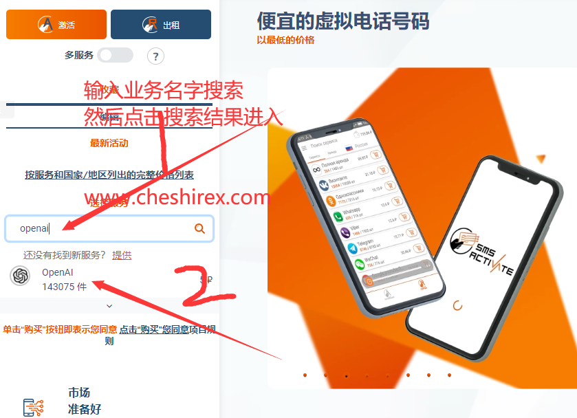
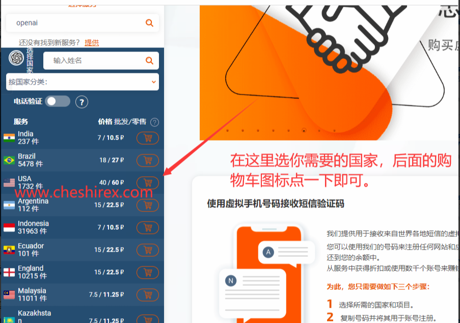
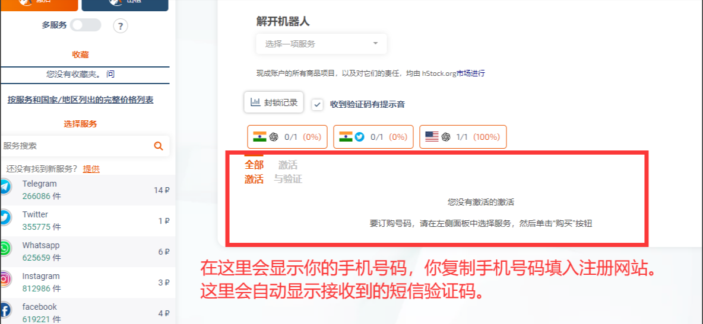

sms-activate是国外得一个付费接码平台，博主实测使用过程还算简便。初次上手可能有些疑惑的地方，下面给大家介绍下博主的接码过程。

本文目录
1. 相关链接
2. 使用教程
2.1. 1.注册账户
2.2. 2.充值余额
2.3. 3.选择注册业务
2.4. 4.选择号码归属地
2.5. 5.等待接收短信
相关链接

[sms-activate 官网](https://sms-activate.io/)

使用教程
1.注册账户
打开sms-activate官网 右上角点击注册即可。

2.充值余额
注册后登陆账户，右上角点击充值，页面下拉可使用支付宝充值。也支持其他很多充值方式，比如虚拟币等。

3.选择注册业务
sms-activate这个平台必须选择你对应的注册业务，不要乱选。否则不会显示验证码。

例，博主注册openai。就可以在左侧搜索openai，然后选择号码国家。

本网内容源自：[翻墙男-科学上网之家](https://fanqiangnan.com/blog/)
