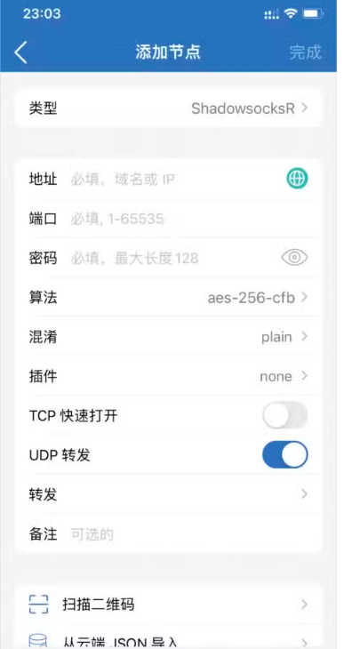

本文文章源自：[翻墙男-科学上网之家](https://fanqiangnan.com/blog/)

[telegram 搜索群](https://t.me/sotianxia)

[telegram 防封防骗 导航频道](https://t.me/xxoo369)

[telegram 共享小火箭帐号  免费节点  VNP群](https://t.me/baipiao365)

Shadowrocket（俗称“小火箭”）是运行于苹果 iOS 系统的代理客户端，同样适用于 iPad 等设备。其兼容性极强，
支持 SS、SSR、V2Ray、Xray、Trojan 等多类代理协议。通过本文所提供的 2025 最新 Shadowrocket 使用指南，
读者可迅速掌握基础操作并顺利完成代理访问配置。

小火箭怎么下载

想要下载小火箭（Shadowrocket），最稳妥的方式就是通过官方链接：

👉 https://apps.apple.com/us/app/shadowrocket/id932747118

当然，你也可以直接登录非大陆地区的 App Store 下载。最推荐的方法是使用美区 Apple ID 登陆美区商店，自行注册一个账号即可，不需要花钱。详细步骤可以查看“免费美区 Apple ID 注册方法”。

[美区 appplee注册方法](https://t.me/xxoo369)

购买价格
区域	价格	
美区 App Store	USD 2.99
港区 App Store	HKD 23.00	
不同区域应用商店购买价格

安装教程

直接在海外 Apple 帐号登录 App Store 后，使用搜索功能找到Shadowrocket下载安装即可（需要购买小火箭），如下图所示。

节点服务器

在小火箭（Shadowrocket）里，节点其实就是服务器。想要用它上网，必须先加一个可用的节点，不然是连不上的。一般节点都可以通过订阅地址获取。

免费节点
小火箭支持的协议挺多，比如 SS、SSR、V2Ray（VMess）、Xray（VLESS）、Trojan 等。如果你想要免费的节点，可以直接去网上搜，很多网站都有分享。

付费节点
免费的节点数量少，还可能不稳定。如果你追求稳定，建议直接买付费的。比如
[宝可梦高速度机场 加入tg群享受每月免费60G](https://web4.52pokemon.cc/register?code=qzhkvhLk)，
就很靠谱，支持 Shadowsocks 和 V2Ray，还有不同套餐和机房可选。   
[telegram 共享小火箭帐号  免费节点  VNP群](https://t.me/baipiao365)

小白用户的话，更推荐买“机场”。只要复制订阅链接导入，就能马上用，非常方便。我这边推荐
[宝可梦高速度机场 加入tg群享受每月免费60G](https://web4.52pokemon.cc/register?code=qzhkvhLk)，
，注册就送60G试用（是每个月送60G哦），国内中转加速，价格也不贵，最低才 7元 元。

自己搭建节点
如果你技术好，想要速度稳定、安全性高，那就可以自己搭建。常见的搭建方式有：

Shadowsocks

SSR

V2Ray（VMess）

Xray（VLESS）

Trojan

怎么加节点？
最简单的办法就是用二维码。你可以在电脑上打开节点二维码，或者把二维码保存到手机。然后在 Shadowrocket 主界面点左上角的“扫一扫”，
直接扫屏幕上的二维码，或者从相册里选二维码图片，就能自动导入节点了。

添加 小火箭 节点
支持添加 小火箭 节点，点击软件主界面左上角 ➕ 按钮，在弹出窗口进入添加节点界面，类型选择 Shadowsocks 后，出现 Shadowsocks 配置界面。

订阅地址添加节点

在小火箭（Shadowrocket）里，加节点除了手动一个个配置，还可以直接用订阅地址或者 Clash 的 YAML 链接，一次性导入，非常方便。

操作也很简单：

打开软件主界面，点左上角的 ➕ 按钮；

在弹出来的窗口里，进入“添加节点”页面；

类型选择 Subscribe；

在 URL 输入框里粘贴你的订阅链接；

备注可以写点方便自己区分的名字，其他选项保持默认就行。

这样一来，所有节点都会自动导入，之后还能自动更新，不用自己每次去改配置。

自动更新小火箭订阅
点击软件主界面右下角设置 -> 订阅设置，请看下面的图片

进入小火箭订阅设置界面，使打开更新按钮，同时也可以设成自动后台更新，如下图所示。

添加 Vmess 节点
协议类型为 V2ray Vess 的 V2Ray 服务器。支持添加 Vmess 节点，点击软件主界面左上角 ➕ 按钮，在弹出窗口进入添加节点界面，类型选择 Vmess 后，出现 Vmess 配置界面。

添加 VLESS 节点
协议类型为 V2ray (4.27.0+) VLESS 的 Xray 服务器。支持添加 VLESS 节点，点击软件主界面左上角 ➕ 按钮，在弹出窗口进入添加节点界面，类型选择 VLESS 后，出现 VLESS 配置界面。

添加 Relay 节点
协议类型为 GOST (2.11+) Relay 的服务器。支持添加 Relay 节点，点击软件主界面左上角 ➕ 按钮，在弹出窗口进入添加节点界面，类型选择 Relay 后，出现 Relay 配置界面。

添加 Socks5 节点
支持添加 Socks5 节点，点击软件主界面左上角 ➕ 按钮，在弹出窗口进入添加节点界面，类型选择 Socks5 后，出现 Socks5 配置界面

添加 Socks5 Over TLS 节点
支持添加 Socks5 Over TLS 节点，点击软件主界面左上角 ➕ 按钮，在弹出窗口进入添加节点界面，类型选择 Socks5 Over TLS 后，出现 Socks5 Over TLS 配置界面。

添加 HTTP 节点
支持添加 HTTP 节点，点击软件主界面左上角 ➕ 按钮，在弹出窗口进入添加节点界面，类型选择 HTTP 后，出现 HTTP 配置界面。

添加 HTTPS 节点
协议类型为 HTTPS，NaiveProxy 的服务器。支持添加 HTTPS 节点，点击软件主界面左上角 ➕ 按钮，在弹出窗口进入添加节点界面，类型选择 HTTPS 后，出现 HTTPS 配置界面。

添加 HTTP2 节点
协议类型为 HTTP2，NaiveProxy 的服务器。支持添加 HTTP2 节点，点击软件主界面左上角 ➕ 按钮，在弹出窗口进入添加节点界面，类型选择 HTTP2 后，出现 HTTP2 配置界面

添加 Trojan 节点
协议类型为 Trojan, Tojan-Go 的服务器。支持添加 Trojan 节点，点击软件主界面左上角 ➕ 按钮，在弹出窗口进入添加节点界面，类型选择 Trojan 后，出现 Trojan 配置界面。

添加 Hysteria 节点
支持添加 Hysteria 节点，点击软件主界面左上角 ➕ 按钮，在弹出窗口进入添加节点界面，类型选择 Hysteria 后，出现 Hysteria 配置界面。

使用教程

当你把节点添加好以后，基本设置就算完成了，这时候就可以直接用代理上网了。不过，建议在使用前先测试一下节点的延迟，看看哪个速度更好。

连通性测试
在软件里点一下“连通性测试”，等个几秒钟，节点右边就会显示一个数值。这个数值越小，说明延迟越低、速度越快。选延迟低的节点来用，一般会更流畅。

开启代理
在经过咱们自己的测试后。选择一个延迟最低或者你想用的地区的小火箭节点后打开右上角的开关进行连接，如下图所示为开启状态。

全局路由
全局路由有以下四项可供选择，分别为配置路由模式、代理路由模式、直连路由模式、场景路由模式

另外本人也自己有做一个网站。专门是做小火箭ID共享的  还有每日更新的高速免费节点。当然还有可以白嫖的优秀VPN推荐

[apple ID共享站 免费共享小火箭ID 免费节点 优秀VPN](https://www.52021299.xyz/)

